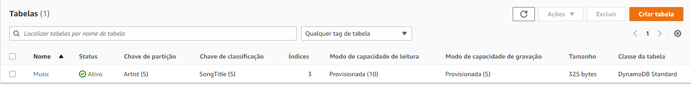
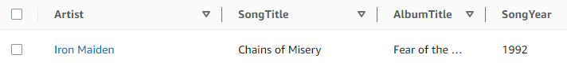
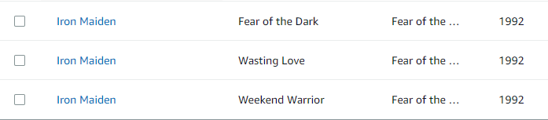
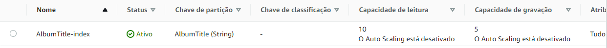
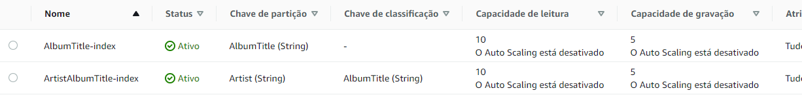
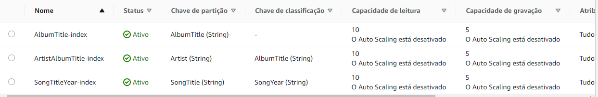

# desafio-dio-dynamodb

Nesse projeto foi feito uma introdução ao DynamoDB da Amazon.
Foram criadas tabelas e índices a partir de linha de comando usando o Amazon CLI.

## Criação da tabela Music

```
aws dynamodb create-table \
    --table-name Music \
    --attribute-definitions \
        AttributeName=Artist,AttributeType=S \
        AttributeName=SongTitle,AttributeType=S \
    --key-schema \
        AttributeName=Artist,KeyType=HASH \
        AttributeName=SongTitle,KeyType=RANGE \
    --provisioned-throughput \
        ReadCapacityUnits=10,WriteCapacityUnits=5
```



## Inserindo um item à tabela Music

```
aws dynamodb put-item \
    --table-name Music \
    --item file://itemmusic.json \
```



## Inserção de múltiplos itens na tabela Music

```
aws dynamodb batch-write-item \
    --request-items file://batchmusic.json
```



## Criação de um index global secundário baseado no título do álbum

```
aws dynamodb update-table \
    --table-name Music \
    --attribute-definitions AttributeName=AlbumTitle,AttributeType=S \
    --global-secondary-index-updates \
        "[{\"Create\":{\"IndexName\": \"AlbumTitle-index\",\"KeySchema\":[{\"AttributeName\":\"AlbumTitle\",\"KeyType\":\"HASH\"}], \
        \"ProvisionedThroughput\": {\"ReadCapacityUnits\": 10, \"WriteCapacityUnits\": 5      },\"Projection\":{\"ProjectionType\":\"ALL\"}}}]"
```



## Criação de um index global secundário baseado no nome do artista e no título do álbum

```
aws dynamodb update-table \
    --table-name Music \
    --attribute-definitions\
        AttributeName=Artist,AttributeType=S \
        AttributeName=AlbumTitle,AttributeType=S \
    --global-secondary-index-updates \
        "[{\"Create\":{\"IndexName\": \"ArtistAlbumTitle-index\",\"KeySchema\":[{\"AttributeName\":\"Artist\",\"KeyType\":\"HASH\"}, {\"AttributeName\":\"AlbumTitle\",\"KeyType\":\"RANGE\"}], \
        \"ProvisionedThroughput\": {\"ReadCapacityUnits\": 10, \"WriteCapacityUnits\": 5      },\"Projection\":{\"ProjectionType\":\"ALL\"}}}]"
```



## Criação de um index global secundário baseado no título da música e no ano

```
aws dynamodb update-table \
    --table-name Music \
    --attribute-definitions\
        AttributeName=SongTitle,AttributeType=S \
        AttributeName=SongYear,AttributeType=S \
    --global-secondary-index-updates \
        "[{\"Create\":{\"IndexName\": \"SongTitleYear-index\",\"KeySchema\":[{\"AttributeName\":\"SongTitle\",\"KeyType\":\"HASH\"}, {\"AttributeName\":\"SongYear\",\"KeyType\":\"RANGE\"}], \
        \"ProvisionedThroughput\": {\"ReadCapacityUnits\": 10, \"WriteCapacityUnits\": 5      },\"Projection\":{\"ProjectionType\":\"ALL\"}}}]"
```


